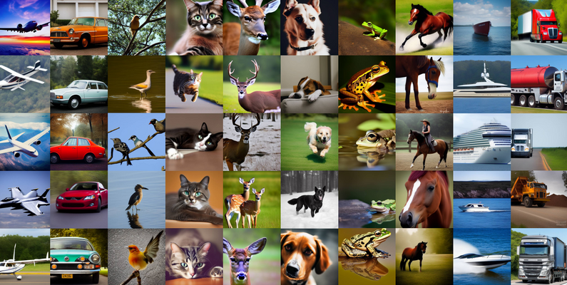

# AI Generated Images Detector 
# (Live Demo Link)[https://ai-image-detector.streamlit.app/]
The proliferation of AI-generated images has raised significant concerns regarding their authenticity and trustworthiness. This project aims to address these concerns by developing an advanced image classification model capable of accurately detecting AI-generated images.

## Dataset:

For this project, we utilize the CIFAKE dataset, which comprises 60,000 synthetically-generated images and an equal number of real images sourced from CIFAR-10. This diverse dataset enables robust training and evaluation of our model.
[Link to the Dataset](https://www.kaggle.com/datasets/birdy654/cifake-real-and-ai-generated-synthetic-images/data)

## Tools and Libraries:

TensorFlow is employed for model development and training, leveraging the computational power of a  GPU to expedite the process  d.

## Data Preparation:

- Data augmentation techniques are integrated into the training pipeline to enhance dataset diversity and improve model generalization.
- Augmentation strategies include random horizontal and vertical flipping, simulating various orientations and perspectives commonly encountered in real-world scenarios.
- Images are resized to a uniform size of 32x32 pixels to ensure consistency across the dataset.
- Normalization is applied to scale pixel values to the range [0, 1], facilitating faster computation and more efficient model training.
- The dataset is split into three subsets: 70% for training, 20% for validation, and 10% for testing, ensuring an appropriate balance for model development and evaluation.

## Model Architecture:

- **Base Model: Pre-trained ResNet50**
  - Leveraging the deep architecture and residual connections of ResNet50 pre-trained on ImageNet for strong feature extraction capabilities.
  - Customized input shape to (32, 32, 3) to align with the dataset's image dimensions.

- **Additional Layers:**
  - A Flatten layer converts 2D feature maps into a 1D vector.
  - Dense layers with 256 and 128 units, employing ReLU activation, to learn high-level representations and patterns.
  - Batch normalization after the first dense layer to enhance training stability.
  - Dropout layer with a rate of 0.5 to mitigate overfitting.
  - Final dense layer with a single unit and sigmoid activation for binary classification.

## Model Training and Evaluation:

- The model is trained on training and validation sets, iteratively improving over 10 epochs.
- Early stopping mechanism halts training if the model fails to improve after three consecutive attempts, optimizing learning efficiency.
- Evaluation conducted on a separate test set comprising previously unseen images.
- Metrics including precision, recall, and accuracy are computed to assess model performance.

## Evaluation Results:

### Plots of Model Accuracy and Loss:

- Precision: 0.949
- Recall: 0.892
- Accuracy: 0.922

### Classification Report:

### Confusion Matrix:

The model demonstrates robust performance, achieving an overall accuracy of 92%. Notably, it exhibits high recall for AI-generated images while maintaining precision for real images, indicative of its effectiveness in distinguishing between the two categories.

## Challenges Addressed:

- Overfitting during initial training stages was mitigated through the implementation of data augmentation techniques and retraining of ResNet50 layers.
- Ensuring the model's ability to generalize well to unseen images posed a significant challenge, necessitating meticulous tuning of architecture and training parameters.

For further inquiries, please feel free to [connect with me](https://www.linkedin.com/in/iamsubhom/).
